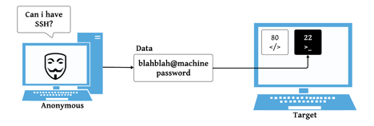
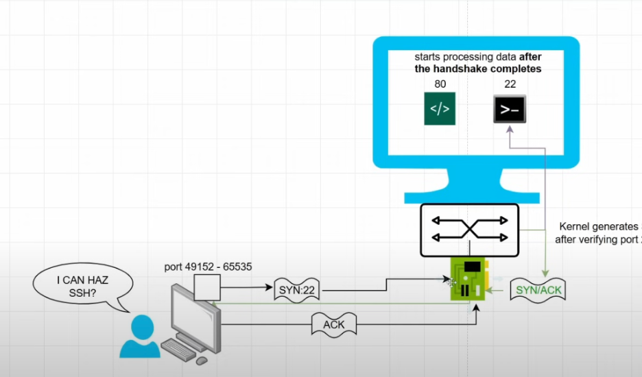

# Điều gì xảy ra ở Transport layer và Network layer ?

Điều gì xảy ra ở Transport layer và Network layer khi một người muốn truy cập vào máy và lấy dữ liệu. (Request access)

Có tồn tại 2 services (port 88 & 22)

## Port 88 & 22

Port 80 và port 22 là cổng giao tiếp mạng dùng cho các dịch vụ khác nhau:

### Port 80:

→ Dùng cho HTTP (HyperText Transfer Protocol)
→ Đây là cổng mặc định khi bạn truy cập web bằng trình duyệt (http://...)
→ Ví dụ: bạn gõ http://example.com thì trình duyệt ngầm kết nối tới cổng 80 của server đó.

### Port 22:

→ Dùng cho SSH (Secure Shell)
→ Đây là cổng để kết nối điều khiển VPS/server từ xa một cách an toàn (mã hóa dữ liệu)
→ Ví dụ: bạn dùng lệnh ssh user@ip-address thì bạn đang vào server qua port 22.

Có một giao thức để làm việc này, gọi là TCP hay còn gọi là (three-way handshake)

Bao gồm 3 packets:

# Command line

## Show packets with SYN flags (for target)

`tcpdump -i eth0 'tcp[tcpflags] & tcp-syn != 0'`

`tcpdump -i any src host 206.189.205.253 -X`

## See log trying to get password attempt

`cat /var/log/auth.log`

## Scan computer ports (for attackers)

export the target ip address for attacker machine
`export TARGET=[YOUR_TARGET_IP_HERE_BRO]`

export TARGET=206.189.205.253

(TEST by echo)

`echo $TARGET`

`nmap $TARGET`

`nmap -Pn $TARGET`

# IPTABLES COMMANDS

Add iptables rule
`iptables -A INPUT -s -j DROP`

`iptables -A INPUT -s 137.184.150.17 -j DROP`

Delete iptables rule
`iptables -D INPUT -s -j DROP`

iptables -D INPUT -s 137.184.150.17 -j DROP

List out iptables rules
`iptables -L -n -v`

Flush all iptables rules
`iptables -F`

`apt install python3-pip`

`python3 firewall_setup.py`

`python3 -m venv ./firewall_venv`

`pip install scapy`
